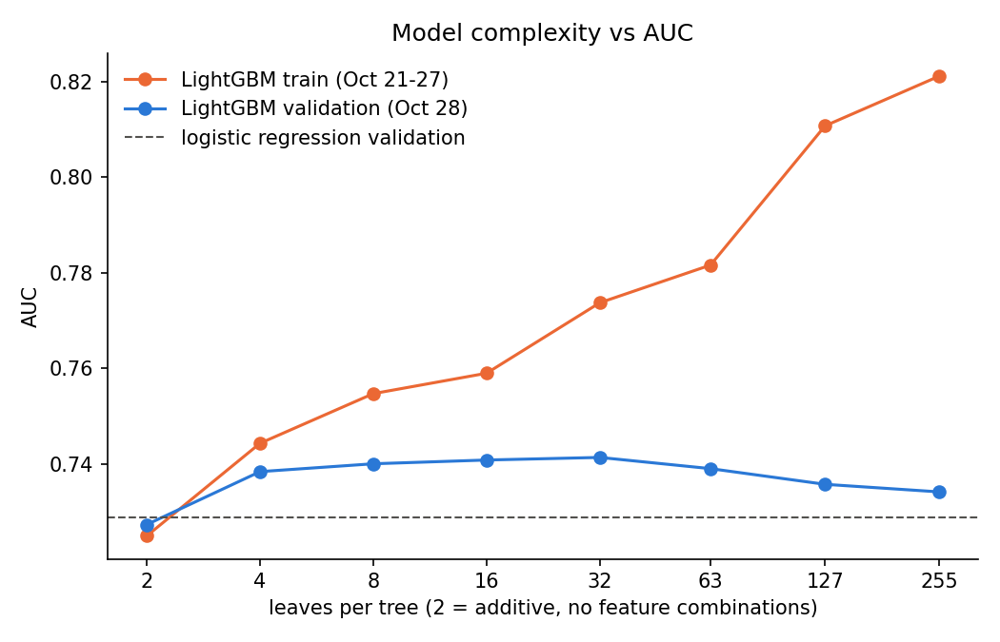

# Complexity sweep — train Oct 21-27 (729,685 rows), validate Oct 28 (142,909 rows)

- same V1 features and settings; only `num_leaves` changes; trees chosen by early stopping on Oct 28 (max 5000)
- 2 leaves = each tree splits on one feature once, so the model is additive (no feature combinations)

| model                     |   num_leaves |   trees |   train_AUC |   val_AUC |   train_logloss |   val_logloss |   val_NE |   fit_seconds |   train_minus_val_AUC |
|:--------------------------|-------------:|--------:|------------:|----------:|----------------:|--------------:|---------:|--------------:|----------------------:|
| lightgbm 2 leaves         |            2 |    1182 |      0.725  |    0.7274 |          0.4273 |        0.4016 |   0.8929 |        4.6791 |               -0.0024 |
| lightgbm 4 leaves         |            4 |     725 |      0.7444 |    0.7385 |          0.4183 |        0.3967 |   0.8821 |        4.1883 |                0.0059 |
| lightgbm 8 leaves         |            8 |     408 |      0.7548 |    0.7401 |          0.4135 |        0.3962 |   0.8809 |        3.3277 |                0.0147 |
| lightgbm 16 leaves        |           16 |     189 |      0.759  |    0.7409 |          0.4118 |        0.3961 |   0.8807 |        2.8201 |                0.0181 |
| lightgbm 32 leaves        |           32 |     141 |      0.7737 |    0.7414 |          0.4048 |        0.3957 |   0.8798 |        3.3764 |                0.0323 |
| lightgbm 63 leaves        |           63 |      82 |      0.7816 |    0.7391 |          0.4021 |        0.3967 |   0.8821 |        3.7875 |                0.0425 |
| lightgbm 127 leaves       |          127 |      82 |      0.8107 |    0.7358 |          0.387  |        0.3979 |   0.8848 |        6.0864 |                0.0749 |
| lightgbm 255 leaves       |          255 |      53 |      0.8211 |    0.7342 |          0.3855 |        0.3989 |   0.887  |        8.313  |                0.0868 |
| logistic regression C=0.1 |          nan |     nan |      0.7375 |    0.729  |          0.4219 |        0.4017 |   0.8932 |       10.1298 |                0.0085 |
