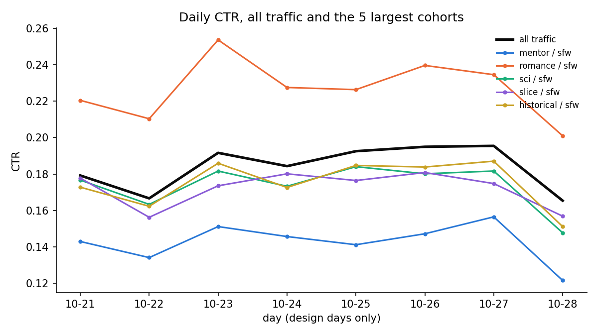

# Drift — temporal shifts, cohorts (genre x safety tier), novelty, fatigue

- design days only (Oct 21-28); the held-out days (Oct 29-30) are excluded
- cohort = genre x safety tier (30 cohorts)
- PSI (population stability index): < 0.1 small, 0.1-0.25 moderate, > 0.25 large shift

## 1. Click behavior over time

| day_label   |   impressions |    ctr |   ci_low |   ci_high |
|:------------|--------------:|-------:|---------:|----------:|
| 10-21       |        111065 | 0.1792 |   0.1769 |    0.1814 |
| 10-22       |        143836 | 0.1666 |   0.1647 |    0.1686 |
| 10-23       |        104452 | 0.1916 |   0.1893 |    0.194  |
| 10-24       |         89378 | 0.1843 |   0.1818 |    0.1869 |
| 10-25       |         90218 | 0.1925 |   0.19   |    0.1951 |
| 10-26       |        103948 | 0.195  |   0.1926 |    0.1974 |
| 10-27       |         86788 | 0.1955 |   0.1928 |    0.1981 |
| 10-28       |        142909 | 0.1654 |   0.1634 |    0.1673 |

### Per cohort (sorted by traffic): does CTR differ by day beyond noise?
| cohort                  |   impressions |   share |    ctr |   min_day_ctr |   max_day_ctr |   p_value_ctr_differs_by_day |
|:------------------------|--------------:|--------:|-------:|--------------:|--------------:|-----------------------------:|
| mentor / sfw            |         65708 |  0.0753 | 0.1416 |        0.1215 |        0.1565 |                       0      |
| romance / sfw           |         54111 |  0.062  | 0.2247 |        0.201  |        0.2537 |                       0      |
| sci / sfw               |         53482 |  0.0613 | 0.1718 |        0.1477 |        0.184  |                       0      |
| slice / sfw             |         51816 |  0.0594 | 0.1706 |        0.1562 |        0.1808 |                       0      |
| historical / sfw        |         51737 |  0.0593 | 0.173  |        0.1511 |        0.1871 |                       0      |
| horror / sfw            |         49930 |  0.0572 | 0.2166 |        0.1991 |        0.2283 |                       0      |
| anime / sfw             |         49771 |  0.057  | 0.1699 |        0.1466 |        0.1916 |                       0      |
| comedic / sfw           |         46576 |  0.0534 | 0.1724 |        0.1524 |        0.1898 |                       0      |
| fantasy / sfw           |         45011 |  0.0516 | 0.1684 |        0.1538 |        0.1833 |                       0      |
| mystery / sfw           |         44336 |  0.0508 | 0.1732 |        0.1569 |        0.1844 |                       0      |
| anime / suggestive      |         27536 |  0.0316 | 0.1722 |        0.1479 |        0.1901 |                       0      |
| horror / suggestive     |         26285 |  0.0301 | 0.2123 |        0.1902 |        0.2398 |                       0      |
| mentor / suggestive     |         25148 |  0.0288 | 0.1437 |        0.1147 |        0.1658 |                       0.0001 |
| comedic / suggestive    |         24184 |  0.0277 | 0.1744 |        0.1537 |        0.1963 |                       0      |
| romance / suggestive    |         23531 |  0.027  | 0.2197 |        0.1959 |        0.2379 |                       0.0001 |
| mystery / suggestive    |         22450 |  0.0257 | 0.1747 |        0.148  |        0.1929 |                       0      |
| fantasy / suggestive    |         22124 |  0.0254 | 0.1746 |        0.1478 |        0.1978 |                       0      |
| slice / suggestive      |         21940 |  0.0251 | 0.1728 |        0.1533 |        0.2028 |                       0.0002 |
| sci / suggestive        |         18496 |  0.0212 | 0.1722 |        0.1496 |        0.1829 |                       0.0232 |
| historical / suggestive |         17237 |  0.0198 | 0.1679 |        0.1442 |        0.1843 |                       0.0007 |
| comedic / mature        |         17030 |  0.0195 | 0.2001 |        0.1797 |        0.2207 |                       0.0015 |
| anime / mature          |         15227 |  0.0175 | 0.1948 |        0.1718 |        0.22   |                       0      |
| horror / mature         |         14730 |  0.0169 | 0.2379 |        0.2245 |        0.2484 |                       0.4534 |
| mystery / mature        |         14250 |  0.0163 | 0.1913 |        0.1751 |        0.2084 |                       0.0917 |
| historical / mature     |         13607 |  0.0156 | 0.1958 |        0.1769 |        0.2147 |                       0.0128 |
| slice / mature          |         13223 |  0.0152 | 0.1993 |        0.1813 |        0.2289 |                       0.0042 |
| romance / mature        |         12759 |  0.0146 | 0.2521 |        0.2356 |        0.2827 |                       0.0817 |
| mentor / mature         |         11983 |  0.0137 | 0.1596 |        0.132  |        0.1855 |                       0.0002 |
| fantasy / mature        |         10959 |  0.0126 | 0.1946 |        0.1714 |        0.2151 |                       0.0146 |
| sci / mature            |          7417 |  0.0085 | 0.1944 |        0.1782 |        0.2093 |                       0.6532 |

- cohorts whose CTR differs by day at p < 0.01: 23 of 30

### Daily CTR of the 10 largest cohorts
| cohort           |   10-21 |   10-22 |   10-23 |   10-24 |   10-25 |   10-26 |   10-27 |   10-28 |
|:-----------------|--------:|--------:|--------:|--------:|--------:|--------:|--------:|--------:|
| mentor / sfw     |  0.1429 |  0.1341 |  0.1511 |  0.1456 |  0.1411 |  0.1472 |  0.1565 |  0.1215 |
| romance / sfw    |  0.2205 |  0.2104 |  0.2537 |  0.2276 |  0.2264 |  0.2397 |  0.2346 |  0.201  |
| sci / sfw        |  0.1767 |  0.1633 |  0.1816 |  0.1733 |  0.184  |  0.1801 |  0.1816 |  0.1477 |
| slice / sfw      |  0.1778 |  0.1562 |  0.1735 |  0.1801 |  0.1764 |  0.1808 |  0.1748 |  0.1568 |
| historical / sfw |  0.1728 |  0.1623 |  0.1859 |  0.1726 |  0.1847 |  0.1838 |  0.1871 |  0.1511 |
| horror / sfw     |  0.2184 |  0.2055 |  0.22   |  0.2283 |  0.2278 |  0.2245 |  0.2274 |  0.1991 |
| anime / sfw      |  0.1668 |  0.1504 |  0.1916 |  0.1711 |  0.1769 |  0.1847 |  0.1914 |  0.1466 |
| comedic / sfw    |  0.1714 |  0.1565 |  0.1788 |  0.1823 |  0.1898 |  0.1862 |  0.1802 |  0.1524 |
| fantasy / sfw    |  0.1668 |  0.1538 |  0.1744 |  0.1665 |  0.177  |  0.1833 |  0.183  |  0.1562 |
| mystery / sfw    |  0.1777 |  0.159  |  0.1844 |  0.1738 |  0.1831 |  0.1819 |  0.183  |  0.1569 |

## 2. Character mix over time
### Share of impressions per cohort by day (10 largest)
| cohort           |   10-21 |   10-22 |   10-23 |   10-24 |   10-25 |   10-26 |   10-27 |   10-28 |
|:-----------------|--------:|--------:|--------:|--------:|--------:|--------:|--------:|--------:|
| mentor / sfw     |  0.1066 |  0.0979 |  0.0886 |  0.0787 |  0.0693 |  0.0607 |  0.0532 |  0.0443 |
| romance / sfw    |  0.0638 |  0.0648 |  0.0633 |  0.0617 |  0.0617 |  0.0619 |  0.0594 |  0.0589 |
| sci / sfw        |  0.0641 |  0.0636 |  0.0631 |  0.0624 |  0.0608 |  0.0586 |  0.0601 |  0.0576 |
| slice / sfw      |  0.0745 |  0.0694 |  0.0641 |  0.0611 |  0.0564 |  0.0533 |  0.0485 |  0.046  |
| historical / sfw |  0.0629 |  0.0612 |  0.0593 |  0.0593 |  0.0586 |  0.0575 |  0.0579 |  0.0571 |
| horror / sfw     |  0.0243 |  0.0336 |  0.0454 |  0.0542 |  0.0633 |  0.0722 |  0.0803 |  0.0884 |
| anime / sfw      |  0.0342 |  0.0409 |  0.0479 |  0.0546 |  0.0588 |  0.0682 |  0.0739 |  0.0798 |
| comedic / sfw    |  0.0574 |  0.0557 |  0.0541 |  0.0551 |  0.0531 |  0.0509 |  0.0506 |  0.0499 |
| fantasy / sfw    |  0.0538 |  0.0525 |  0.0541 |  0.0522 |  0.0518 |  0.0505 |  0.049  |  0.0489 |
| mystery / sfw    |  0.0534 |  0.0527 |  0.0508 |  0.052  |  0.0512 |  0.0491 |  0.0495 |  0.0479 |

|       |   cohort mix PSI vs first day |   share of impressions from top-100 characters |   share from characters created Oct 21+ |
|:------|------------------------------:|-----------------------------------------------:|----------------------------------------:|
| 10-21 |                        0      |                                         0.1481 |                                  0.0037 |
| 10-22 |                        0.0109 |                                         0.1372 |                                  0.0094 |
| 10-23 |                        0.0411 |                                         0.1308 |                                  0.0133 |
| 10-24 |                        0.079  |                                         0.125  |                                  0.0183 |
| 10-25 |                        0.1347 |                                         0.1238 |                                  0.0263 |
| 10-26 |                        0.1961 |                                         0.1252 |                                  0.0316 |
| 10-27 |                        0.2549 |                                         0.1301 |                                  0.0337 |
| 10-28 |                        0.3418 |                                         0.1374 |                                  0.0407 |

### Day-to-day churn of character popularity (Spearman correlation of impressions per character)
|                    |   spearman_character_impressions |
|:-------------------|---------------------------------:|
| ('10-21', '10-22') |                           0.9294 |
| ('10-22', '10-23') |                           0.9323 |
| ('10-23', '10-24') |                           0.9271 |
| ('10-24', '10-25') |                           0.9162 |
| ('10-25', '10-26') |                           0.9212 |
| ('10-26', '10-27') |                           0.9245 |
| ('10-27', '10-28') |                           0.9231 |

## 3. Novelty
### CTR by character age at impression (days since created_at)
| character_age_bucket   |   impressions |    ctr |   ci_low |   ci_high |
|:-----------------------|--------------:|-------:|---------:|----------:|
| 0-7                    |         28443 | 0.1748 |   0.1704 |    0.1793 |
| 8-30                   |         72040 | 0.1834 |   0.1806 |    0.1863 |
| 31-90                  |        166588 | 0.1826 |   0.1807 |    0.1844 |
| 91-180                 |        266216 | 0.182  |   0.1805 |    0.1835 |
| 181+                   |        339307 | 0.1814 |   0.1801 |    0.1827 |

### CTR by creative age (hours since first seen; creatives first seen after the first day only)
| creative_age   |   impressions |    ctr |   ci_low |   ci_high |
|:---------------|--------------:|-------:|---------:|----------:|
| 0-5 h          |        117383 | 0.136  |   0.1341 |    0.138  |
| 6-23 h         |         55748 | 0.1527 |   0.1497 |    0.1557 |
| day 2          |         31467 | 0.1522 |   0.1483 |    0.1562 |
| day 3          |         11650 | 0.1712 |   0.1645 |    0.1782 |
| day 4+         |         24707 | 0.2052 |   0.2003 |    0.2103 |

## 4. Fatigue per cohort (returning users)
### CTR by the user's impressions with the same cohort in the previous 24h
| cohort_exposures_24h   |   impressions |    ctr |   ci_low |   ci_high |
|:-----------------------|--------------:|-------:|---------:|----------:|
| 0                      |        137740 | 0.1587 |   0.1568 |    0.1606 |
| 1                      |         16190 | 0.1506 |   0.1452 |    0.1562 |
| 2-4                    |          8473 | 0.1429 |   0.1356 |    0.1505 |
| 5+                     |          3175 | 0.1751 |   0.1623 |    0.1887 |

### Same, for the 5 largest cohorts on the last design day (10-28), i.e. the dominant cohorts going into the held-out days
| cohort           |      0 |      1 |    2-4 |     5+ |
|:-----------------|-------:|-------:|-------:|-------:|
| horror / sfw     | 0.2063 | 0.1944 | 0.1702 | 0.148  |
| anime / sfw      | 0.1505 | 0.1465 | 0.1175 | 0.1602 |
| romance / sfw    | 0.1958 | 0.1789 | 0.1997 | 0.2087 |
| sci / sfw        | 0.1439 | 0.142  | 0.1195 | 0.1635 |
| historical / sfw | 0.1535 | 0.1427 | 0.128  | 0.1599 |

### Returning users: CTR by whether they saw this creative in the previous 24h
| saw_this_ad_24h   |   impressions |    ctr |   ci_low |   ci_high |
|:------------------|--------------:|-------:|---------:|----------:|
| False             |        100542 | 0.1744 |   0.1721 |    0.1768 |
| True              |         65036 | 0.1311 |   0.1285 |    0.1337 |

### Exposure concentration (mean over days)
| cohort                  |   share of a cohort-day's impressions on its top-5 creatives |
|:------------------------|-------------------------------------------------------------:|
| mentor / sfw            |                                                       0.1772 |
| romance / sfw           |                                                       0.1781 |
| sci / sfw               |                                                       0.1785 |
| slice / sfw             |                                                       0.1786 |
| historical / sfw        |                                                       0.1763 |
| horror / sfw            |                                                       0.1765 |
| anime / sfw             |                                                       0.1768 |
| comedic / sfw           |                                                       0.1759 |
| fantasy / sfw           |                                                       0.1781 |
| mystery / sfw           |                                                       0.1774 |
| anime / suggestive      |                                                       0.1731 |
| horror / suggestive     |                                                       0.1754 |
| mentor / suggestive     |                                                       0.1795 |
| comedic / suggestive    |                                                       0.1783 |
| romance / suggestive    |                                                       0.1793 |
| mystery / suggestive    |                                                       0.1781 |
| fantasy / suggestive    |                                                       0.1839 |
| slice / suggestive      |                                                       0.1792 |
| sci / suggestive        |                                                       0.1811 |
| historical / suggestive |                                                       0.1772 |
| comedic / mature        |                                                       0.1814 |
| anime / mature          |                                                       0.181  |
| horror / mature         |                                                       0.1815 |
| mystery / mature        |                                                       0.1809 |
| historical / mature     |                                                       0.1769 |
| slice / mature          |                                                       0.1851 |
| romance / mature        |                                                       0.1835 |
| mentor / mature         |                                                       0.184  |
| fantasy / mature        |                                                       0.1834 |
| sci / mature            |                                                       0.1816 |

## 5. Feature distribution shift (PSI of each day vs Oct 21; top-50 values + other)
|       |   cohort |   publisher_id |    C17 |    C14 |   device_type |   device_conn_type |   banner_pos |   is_app |
|:------|---------:|---------------:|-------:|-------:|--------------:|-------------------:|-------------:|---------:|
| 10-21 |   0      |         0      | 0      | 0      |        0      |             0      |       0      |   0      |
| 10-22 |   0.0109 |         0.4587 | 2.5565 | 1.6729 |        0.0016 |             0.0048 |       0.0015 |   0.0022 |
| 10-23 |   0.0411 |         0.417  | 1.5324 | 0.7503 |        0.0014 |             0.0054 |       0.0048 |   0.015  |
| 10-24 |   0.079  |         0.6721 | 1.9375 | 1.0423 |        0.0006 |             0.1037 |       0.0049 |   0.0099 |
| 10-25 |   0.1347 |         0.5717 | 2.6442 | 1.2166 |        0.0035 |             0.1307 |       0.0158 |   0.0156 |
| 10-26 |   0.1961 |         0.5491 | 2.4985 | 1.2484 |        0.0033 |             0.0791 |       0.0132 |   0.0206 |
| 10-27 |   0.2549 |         0.5205 | 2.5107 | 1.3601 |        0.0593 |             0.1138 |       0.004  |   0.0044 |
| 10-28 |   0.3418 |         0.7806 | 3.9314 | 1.9909 |        0.0007 |             0.0711 |       0.0273 |   0.0001 |
