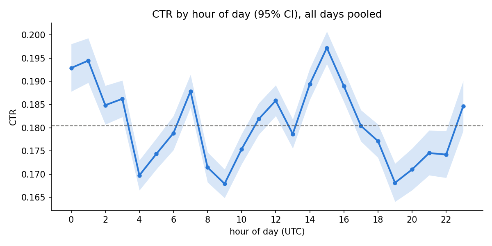

# 01 — Hour of day and split comparison

## 1. CTR by hour of day

- hour-of-day CTR range: 0.1679 (hour 9) to 0.1972 (hour 15)
- std of CTR across the 222 hours: **0.0198**; std expected from binomial noise alone: **0.0066**

|   hour_of_day |      n |    ctr |   ci_low |   ci_high |
|--------------:|-------:|-------:|---------:|----------:|
|             0 | 22,844 | 0.1929 |   0.1878 |    0.198  |
|             1 | 26,129 | 0.1945 |   0.1897 |    0.1993 |
|             2 | 33,134 | 0.1849 |   0.1807 |    0.1891 |
|             3 | 37,556 | 0.1862 |   0.1823 |    0.1902 |
|             4 | 51,512 | 0.1697 |   0.1665 |    0.173  |
|             5 | 50,110 | 0.1744 |   0.1711 |    0.1777 |
|             6 | 41,918 | 0.1788 |   0.1752 |    0.1825 |
|             7 | 46,028 | 0.1879 |   0.1843 |    0.1915 |
|             8 | 52,057 | 0.1715 |   0.1683 |    0.1747 |
|             9 | 56,437 | 0.1679 |   0.1649 |    0.171  |
|            10 | 52,558 | 0.1754 |   0.1722 |    0.1787 |
|            11 | 49,625 | 0.1819 |   0.1785 |    0.1853 |
|            12 | 52,875 | 0.1858 |   0.1825 |    0.1892 |
|            13 | 57,894 | 0.1787 |   0.1756 |    0.1818 |
|            14 | 52,367 | 0.1894 |   0.1861 |    0.1928 |
|            15 | 49,486 | 0.1972 |   0.1937 |    0.2007 |
|            16 | 49,887 | 0.189  |   0.1856 |    0.1924 |
|            17 | 50,013 | 0.1804 |   0.1771 |    0.1838 |
|            18 | 43,443 | 0.1771 |   0.1736 |    0.1807 |
|            19 | 31,829 | 0.1681 |   0.1641 |    0.1723 |
|            20 | 26,993 | 0.171  |   0.1666 |    0.1755 |
|            21 | 23,735 | 0.1746 |   0.1698 |    0.1794 |
|            22 | 21,656 | 0.1742 |   0.1692 |    0.1793 |
|            23 | 19,914 | 0.1846 |   0.1793 |    0.1901 |

## 2. Random vs temporal split, identical LightGBM
- features: banner_pos, site_id, site_domain, site_category, app_id, app_domain, app_category, device_model, device_type, device_conn_type, C1, C14, C15, C16, C17, C18, C19, C20, C21, hour_of_day
- categorical codes from fit_category_maps(min_count=20) on each train part; rare/unseen -> 0
- params: num_leaves 63, learning_rate 0.05, min_data_in_leaf 100, early stopping 50 rounds on the val part, max 1000 rounds
- random_row: 80/10/10 rows; random_user: 80/10/10 by user (GroupShuffleSplit); split seeds 42, 43, 44
- temporal: train Oct 21-27 / val Oct 28 / test Oct 29-30
- NE base rate = the test part's own CTR

### Per run
|                  |   train_rows |   val_rows |   test_rows |   best_iteration |   logloss |     NE |    AUC |    ECE |   mean_pred |   actual_ctr |
|:-----------------|-------------:|-----------:|------------:|-----------------:|----------:|-------:|-------:|-------:|------------:|-------------:|
| temporal / -     |      729,685 |    142,909 |     127,406 |               57 |    0.4218 | 0.9208 | 0.6971 | 0.0067 |      0.1653 |       0.1714 |
| random_row / 42  |      800,000 |    100,000 |     100,000 |              110 |    0.4191 | 0.8932 | 0.7254 | 0.0041 |      0.1804 |       0.1785 |
| random_user / 42 |      801,559 |     99,238 |      99,203 |              109 |    0.4257 | 0.8979 | 0.722  | 0.0051 |      0.1797 |       0.1818 |
| random_row / 43  |      800,000 |    100,000 |     100,000 |              105 |    0.4205 | 0.8927 | 0.726  | 0.0047 |      0.1794 |       0.1797 |
| random_user / 43 |      800,425 |     99,449 |     100,126 |              116 |    0.4231 | 0.8981 | 0.7216 | 0.0028 |      0.1795 |       0.1798 |
| random_row / 44  |      800,000 |    100,000 |     100,000 |               96 |    0.4225 | 0.8946 | 0.7243 | 0.0026 |      0.1808 |       0.1806 |
| random_user / 44 |      800,908 |     98,631 |     100,461 |              126 |    0.4208 | 0.8943 | 0.7252 | 0.004  |      0.1793 |       0.1795 |

### Test rows whose user / value was not in the train part
|                  |   test_rows_user_in_train |   test_unseen_site_id |   test_unseen_app_id |   test_unseen_device_model |   test_unseen_C14 |
|:-----------------|--------------------------:|----------------------:|---------------------:|---------------------------:|------------------:|
| temporal / -     |                    0.159  |                0.0138 |               0.0179 |                     0.0308 |            0.4644 |
| random_row / 42  |                    0.3091 |                0.0115 |               0.0114 |                     0.0217 |            0.0067 |
| random_user / 42 |                    0      |                0.0114 |               0.0109 |                     0.0229 |            0.0065 |
| random_row / 43  |                    0.306  |                0.012  |               0.011  |                     0.0215 |            0.0071 |
| random_user / 43 |                    0      |                0.0112 |               0.0121 |                     0.0225 |            0.0064 |
| random_row / 44  |                    0.3063 |                0.0111 |               0.0109 |                     0.0219 |            0.0069 |
| random_user / 44 |                    0      |                0.0117 |               0.0122 |                     0.022  |            0.0075 |

### Per scheme (mean and std over split seeds)
| scheme      |   logloss_mean |   logloss_std |   NE_mean |   NE_std |   AUC_mean |   AUC_std |   ECE_mean |   ECE_std |
|:------------|---------------:|--------------:|----------:|---------:|-----------:|----------:|-----------:|----------:|
| random_row  |         0.4207 |        0.0017 |    0.8935 |   0.001  |     0.7252 |    0.0009 |     0.0038 |    0.0011 |
| random_user |         0.4232 |        0.0025 |    0.8967 |   0.0021 |     0.7229 |    0.002  |     0.0039 |    0.0011 |
| temporal    |         0.4218 |      nan      |    0.9208 | nan      |     0.6971 |  nan      |     0.0067 |  nan      |

### Gaps between scheme means
|                          |   logloss |     NE |     AUC |    ECE |
|:-------------------------|----------:|-------:|--------:|-------:|
| temporal - random_row    |    0.0012 | 0.0273 | -0.0281 | 0.0029 |
| temporal - random_user   |   -0.0014 | 0.024  | -0.0258 | 0.0028 |
| random_user - random_row |    0.0026 | 0.0033 | -0.0023 | 0.0001 |
