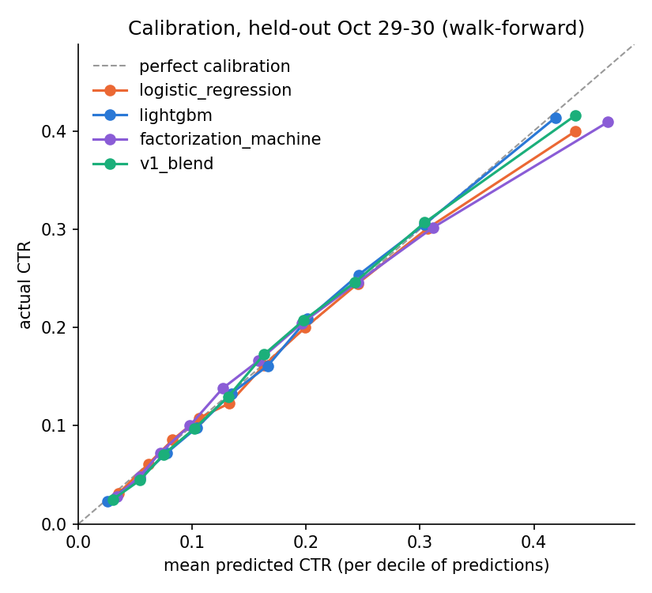

# V1 results — walk-forward, retrained every 6 hours

- V1 = blend of LightGBM and the factorization machine (50/50 in log-odds); constant and logistic regression are baselines
- every 6 hours (00, 06, 12, 18h) all models are retrained on all rows before that hour and predict the next 6 hours
- Oct 21-23 are warm-up only (the first model trains on 3 days); 25 blocks are scored, Oct 24 00h to Oct 30 00h
- development = blocks we made design choices on; held-out = blocks kept back for the final numbers; last 24 hours = the
  most-trained models; metrics pool all rows of a period (each row counts once)
- tree count and FM passes picked once on Oct 28 (train Oct 21-27, 729,685 rows): LightGBM 189 rounds,
  FM 2.75 passes; logistic regression C: 0.01 (Oct 28 logloss by C: 0.01: 0.4007, 0.1: 0.4017, 1.0: 0.4073)

## 1. By period (rows pooled)
|                                                                        |    rows |   logloss |     NE |    AUC |   AUC_within_publisher |    ECE |   mean_pred |   actual_ctr |
|:-----------------------------------------------------------------------|--------:|----------:|-------:|-------:|-----------------------:|-------:|------------:|-------------:|
| ('development (Oct 24-Oct 28)', 'constant')                            | 513,241 |    0.4783 | 1      | 0.4929 |                 0.5003 | 0.0025 |      0.182  |       0.1845 |
| ('development (Oct 24-Oct 28)', 'logistic_regression')                 | 513,241 |    0.4299 | 0.8987 | 0.7211 |                 0.5919 | 0.0072 |      0.1918 |       0.1845 |
| ('development (Oct 24-Oct 28)', 'lightgbm')                            | 513,241 |    0.4246 | 0.8878 | 0.73   |                 0.6124 | 0.0063 |      0.1887 |       0.1845 |
| ('development (Oct 24-Oct 28)', 'factorization_machine')               | 513,241 |    0.4275 | 0.8938 | 0.7267 |                 0.6063 | 0.0103 |      0.1874 |       0.1845 |
| ('development (Oct 24-Oct 28)', 'v1_blend')                            | 513,241 |    0.4243 | 0.8872 | 0.7315 |                 0.6156 | 0.007  |      0.1871 |       0.1845 |
| ('held-out (Oct 29-Oct 30)', 'constant')                               | 127,406 |    0.4585 | 1      | 0.5006 |                 0.5056 | 0.0098 |      0.1812 |       0.1714 |
| ('held-out (Oct 29-Oct 30)', 'logistic_regression')                    | 127,406 |    0.4138 | 0.9026 | 0.7184 |                 0.5955 | 0.006  |      0.1767 |       0.1714 |
| ('held-out (Oct 29-Oct 30)', 'lightgbm')                               | 127,406 |    0.4057 | 0.8849 | 0.7358 |                 0.6247 | 0.0047 |      0.1731 |       0.1714 |
| ('held-out (Oct 29-Oct 30)', 'factorization_machine')                  | 127,406 |    0.4097 | 0.8938 | 0.7292 |                 0.6176 | 0.0107 |      0.176  |       0.1714 |
| ('held-out (Oct 29-Oct 30)', 'v1_blend')                               | 127,406 |    0.4058 | 0.8851 | 0.7361 |                 0.6275 | 0.0076 |      0.1735 |       0.1714 |
| ('last 24 hours (Oct 29 06:00-Oct 30 06:00)', 'constant')              | 103,499 |    0.457  | 1      | 0.4968 |                 0.4969 | 0.0106 |      0.1811 |       0.1705 |
| ('last 24 hours (Oct 29 06:00-Oct 30 06:00)', 'logistic_regression')   | 103,499 |    0.4126 | 0.9028 | 0.7182 |                 0.5991 | 0.0061 |      0.1757 |       0.1705 |
| ('last 24 hours (Oct 29 06:00-Oct 30 06:00)', 'lightgbm')              | 103,499 |    0.4042 | 0.8844 | 0.7369 |                 0.6285 | 0.0063 |      0.172  |       0.1705 |
| ('last 24 hours (Oct 29 06:00-Oct 30 06:00)', 'factorization_machine') | 103,499 |    0.4083 | 0.8934 | 0.7299 |                 0.6228 | 0.0105 |      0.1742 |       0.1705 |
| ('last 24 hours (Oct 29 06:00-Oct 30 06:00)', 'v1_blend')              | 103,499 |    0.4043 | 0.8845 | 0.7372 |                 0.6321 | 0.0085 |      0.172  |       0.1705 |

## 2. V1 per day
|            |   trained_on_rows |    rows |   logloss |     NE |    AUC |   AUC_within_publisher |    ECE |   mean_pred |   actual_ctr |
|:-----------|------------------:|--------:|----------:|-------:|-------:|-----------------------:|-------:|------------:|-------------:|
| 2014-10-24 |           359,353 |  89,378 |    0.4323 | 0.9043 | 0.7125 |                 0.6028 | 0.0095 |      0.1919 |       0.1843 |
| 2014-10-25 |           448,731 |  90,218 |    0.4361 | 0.8893 | 0.7274 |                 0.6242 | 0.008  |      0.1959 |       0.1925 |
| 2014-10-26 |           538,949 | 103,948 |    0.4401 | 0.891  | 0.7255 |                 0.6153 | 0.0078 |      0.1986 |       0.195  |
| 2014-10-27 |           642,897 |  86,788 |    0.4344 | 0.8785 | 0.7369 |                 0.6206 | 0.0106 |      0.1944 |       0.1955 |
| 2014-10-28 |           729,685 | 142,909 |    0.3944 | 0.8773 | 0.7434 |                 0.6214 | 0.0089 |      0.1659 |       0.1654 |
| 2014-10-29 |           872,594 | 104,450 |    0.4071 | 0.8842 | 0.7368 |                 0.6282 | 0.006  |      0.1745 |       0.1727 |
| 2014-10-30 |           977,044 |  22,956 |    0.3998 | 0.8894 | 0.732  |                 0.6378 | 0.0168 |      0.1691 |       0.1655 |

## 3. V1 per 6-hour block
|                |   trained_on_rows |   rows |   logloss |     NE |    AUC |   AUC_within_publisher |    ECE |   mean_pred |   actual_ctr |
|:---------------|------------------:|-------:|----------:|-------:|-------:|-----------------------:|-------:|------------:|-------------:|
| 2014-10-24 00h |           359,353 | 20,296 |    0.4375 | 0.9114 | 0.702  |                 0.5985 | 0.0096 |      0.186  |       0.1856 |
| 2014-10-24 06h |           379,649 | 26,046 |    0.4375 | 0.9086 | 0.7075 |                 0.5992 | 0.0143 |      0.2    |       0.1866 |
| 2014-10-24 12h |           405,695 | 35,356 |    0.4328 | 0.8982 | 0.7187 |                 0.6045 | 0.009  |      0.1931 |       0.1868 |
| 2014-10-24 18h |           441,051 |  7,680 |    0.3984 | 0.8985 | 0.7184 |                 0.6008 | 0.0168 |      0.1744 |       0.1616 |
| 2014-10-25 00h |           448,731 | 12,132 |    0.4338 | 0.9153 | 0.7055 |                 0.5956 | 0.0175 |      0.199  |       0.1817 |
| 2014-10-25 06h |           460,863 | 24,132 |    0.4375 | 0.8902 | 0.725  |                 0.6246 | 0.0107 |      0.1949 |       0.1932 |
| 2014-10-25 12h |           484,995 | 36,049 |    0.4432 | 0.8875 | 0.7262 |                 0.6281 | 0.0097 |      0.1955 |       0.1984 |
| 2014-10-25 18h |           521,044 | 17,905 |    0.4216 | 0.8744 | 0.7463 |                 0.6412 | 0.0129 |      0.1957 |       0.1872 |
| 2014-10-26 00h |           538,949 | 18,744 |    0.451  | 0.8884 | 0.7273 |                 0.6095 | 0.0101 |      0.2109 |       0.2041 |
| 2014-10-26 06h |           557,693 | 33,266 |    0.4367 | 0.8926 | 0.724  |                 0.6127 | 0.0085 |      0.1958 |       0.1918 |
| 2014-10-26 12h |           590,959 | 35,103 |    0.4471 | 0.8937 | 0.7194 |                 0.6212 | 0.0133 |      0.201  |       0.1993 |
| 2014-10-26 18h |           626,062 | 16,835 |    0.4198 | 0.8848 | 0.7363 |                 0.6286 | 0.0103 |      0.1857 |       0.182  |
| 2014-10-27 00h |           642,897 | 17,471 |    0.4433 | 0.8881 | 0.7296 |                 0.6258 | 0.0212 |      0.1958 |       0.1986 |
| 2014-10-27 06h |           660,368 | 23,305 |    0.4327 | 0.8757 | 0.7371 |                 0.6101 | 0.0149 |      0.1904 |       0.1952 |
| 2014-10-27 12h |           683,673 | 26,033 |    0.4475 | 0.8854 | 0.7279 |                 0.6192 | 0.0119 |      0.2015 |       0.2028 |
| 2014-10-27 18h |           709,706 | 19,979 |    0.4115 | 0.8633 | 0.7541 |                 0.6439 | 0.0138 |      0.1887 |       0.1835 |
| 2014-10-28 00h |           729,685 | 21,708 |    0.4313 | 0.9011 | 0.7196 |                 0.6248 | 0.0155 |      0.1922 |       0.1848 |
| 2014-10-28 06h |           751,393 | 41,718 |    0.3917 | 0.89   | 0.7284 |                 0.6156 | 0.0118 |      0.1571 |       0.1588 |
| 2014-10-28 12h |           793,111 | 52,293 |    0.394  | 0.8709 | 0.7516 |                 0.6277 | 0.0118 |      0.1686 |       0.1672 |
| 2014-10-28 18h |           845,404 | 27,190 |    0.3702 | 0.8495 | 0.7653 |                 0.6311 | 0.0113 |      0.1532 |       0.1562 |
| 2014-10-29 00h |           872,594 | 23,907 |    0.4123 | 0.8874 | 0.7312 |                 0.6126 | 0.0078 |      0.1801 |       0.1755 |
| 2014-10-29 06h |           896,501 | 31,216 |    0.398  | 0.8878 | 0.7316 |                 0.6389 | 0.0073 |      0.1635 |       0.1646 |
| 2014-10-29 12h |           927,717 | 31,211 |    0.4089 | 0.8831 | 0.7377 |                 0.6383 | 0.0103 |      0.181  |       0.1745 |
| 2014-10-29 18h |           958,928 | 18,116 |    0.4127 | 0.8757 | 0.7476 |                 0.6299 | 0.0134 |      0.1749 |       0.18   |
| 2014-10-30 00h |           977,044 | 22,956 |    0.3998 | 0.8894 | 0.732  |                 0.6378 | 0.0168 |      0.1691 |       0.1655 |

### Spread across blocks
|                                                                       |   row-weighted mean |    min |    max |   blocks |
|:----------------------------------------------------------------------|--------------------:|-------:|-------:|---------:|
| ('development (Oct 24-Oct 28)', 'AUC')                                |              0.7299 | 0.702  | 0.7653 |       20 |
| ('development (Oct 24-Oct 28)', 'AUC_within_publisher')               |              0.6191 | 0.5956 | 0.6439 |       20 |
| ('development (Oct 24-Oct 28)', 'logloss')                            |              0.4243 | 0.3702 | 0.451  |       20 |
| ('held-out (Oct 29-Oct 30)', 'AUC')                                   |              0.7354 | 0.7312 | 0.7476 |        5 |
| ('held-out (Oct 29-Oct 30)', 'AUC_within_publisher')                  |              0.6324 | 0.6126 | 0.6389 |        5 |
| ('held-out (Oct 29-Oct 30)', 'logloss')                               |              0.4058 | 0.398  | 0.4127 |        5 |
| ('last 24 hours (Oct 29 06:00-Oct 30 06:00)', 'AUC')                  |              0.7363 | 0.7316 | 0.7476 |        4 |
| ('last 24 hours (Oct 29 06:00-Oct 30 06:00)', 'AUC_within_publisher') |              0.6369 | 0.6299 | 0.6389 |        4 |
| ('last 24 hours (Oct 29 06:00-Oct 30 06:00)', 'logloss')              |              0.4043 | 0.398  | 0.4127 |        4 |

## 4. All models per day
|                                         |    rows |   logloss |     NE |    AUC |   AUC_within_publisher |    ECE |   mean_pred |   actual_ctr |
|:----------------------------------------|--------:|----------:|-------:|-------:|-----------------------:|-------:|------------:|-------------:|
| ('2014-10-24', 'constant')              |  89,378 |    0.478  | 1      | 0.4942 |                 0.488  | 0.0059 |      0.1784 |       0.1843 |
| ('2014-10-24', 'logistic_regression')   |  89,378 |    0.4354 | 0.9108 | 0.7068 |                 0.5923 | 0.0104 |      0.1947 |       0.1843 |
| ('2014-10-24', 'lightgbm')              |  89,378 |    0.4325 | 0.9049 | 0.7103 |                 0.5982 | 0.0064 |      0.188  |       0.1843 |
| ('2014-10-24', 'factorization_machine') |  89,378 |    0.4357 | 0.9116 | 0.7083 |                 0.5937 | 0.0136 |      0.1979 |       0.1843 |
| ('2014-10-24', 'v1_blend')              |  89,378 |    0.4323 | 0.9043 | 0.7125 |                 0.6028 | 0.0095 |      0.1919 |       0.1843 |
| ('2014-10-25', 'constant')              |  90,218 |    0.4904 | 1      | 0.5026 |                 0.4997 | 0.0127 |      0.1798 |       0.1925 |
| ('2014-10-25', 'logistic_regression')   |  90,218 |    0.441  | 0.8993 | 0.7183 |                 0.5997 | 0.0061 |      0.1962 |       0.1925 |
| ('2014-10-25', 'lightgbm')              |  90,218 |    0.4359 | 0.8888 | 0.7263 |                 0.6223 | 0.0057 |      0.1963 |       0.1925 |
| ('2014-10-25', 'factorization_machine') |  90,218 |    0.4396 | 0.8963 | 0.7224 |                 0.6133 | 0.0115 |      0.1971 |       0.1925 |
| ('2014-10-25', 'v1_blend')              |  90,218 |    0.4361 | 0.8893 | 0.7274 |                 0.6242 | 0.008  |      0.1959 |       0.1925 |
| ('2014-10-26', 'constant')              | 103,948 |    0.4939 | 1      | 0.4927 |                 0.4913 | 0.0126 |      0.1824 |       0.195  |
| ('2014-10-26', 'logistic_regression')   | 103,948 |    0.4461 | 0.9033 | 0.7142 |                 0.5886 | 0.0079 |      0.2021 |       0.195  |
| ('2014-10-26', 'lightgbm')              | 103,948 |    0.4403 | 0.8915 | 0.7239 |                 0.6118 | 0.0062 |      0.1987 |       0.195  |
| ('2014-10-26', 'factorization_machine') | 103,948 |    0.4432 | 0.8974 | 0.721  |                 0.6088 | 0.0089 |      0.2003 |       0.195  |
| ('2014-10-26', 'v1_blend')              | 103,948 |    0.4401 | 0.891  | 0.7255 |                 0.6153 | 0.0078 |      0.1986 |       0.195  |
| ('2014-10-27', 'constant')              |  86,788 |    0.4945 | 1      | 0.4934 |                 0.4889 | 0.0112 |      0.1842 |       0.1955 |
| ('2014-10-27', 'logistic_regression')   |  86,788 |    0.4422 | 0.8942 | 0.7229 |                 0.5876 | 0.0061 |      0.1978 |       0.1955 |
| ('2014-10-27', 'lightgbm')              |  86,788 |    0.4346 | 0.8789 | 0.7352 |                 0.6193 | 0.0072 |      0.1986 |       0.1955 |
| ('2014-10-27', 'factorization_machine') |  86,788 |    0.4377 | 0.8852 | 0.7328 |                 0.6124 | 0.0144 |      0.1921 |       0.1955 |
| ('2014-10-27', 'v1_blend')              |  86,788 |    0.4344 | 0.8785 | 0.7369 |                 0.6206 | 0.0106 |      0.1944 |       0.1955 |
| ('2014-10-28', 'constant')              | 142,909 |    0.4496 | 1      | 0.5108 |                 0.5124 | 0.0186 |      0.184  |       0.1654 |
| ('2014-10-28', 'logistic_regression')   | 142,909 |    0.4001 | 0.8898 | 0.7316 |                 0.5951 | 0.0105 |      0.1759 |       0.1654 |
| ('2014-10-28', 'lightgbm')              | 142,909 |    0.3951 | 0.8787 | 0.7419 |                 0.6162 | 0.0076 |      0.171  |       0.1654 |
| ('2014-10-28', 'factorization_machine') | 142,909 |    0.3971 | 0.8832 | 0.7384 |                 0.615  | 0.0114 |      0.1626 |       0.1654 |
| ('2014-10-28', 'v1_blend')              | 142,909 |    0.3944 | 0.8773 | 0.7434 |                 0.6214 | 0.0089 |      0.1659 |       0.1654 |
| ('2014-10-29', 'constant')              | 104,450 |    0.4604 | 1      | 0.4954 |                 0.5092 | 0.0086 |      0.1813 |       0.1727 |
| ('2014-10-29', 'logistic_regression')   | 104,450 |    0.4146 | 0.9005 | 0.7208 |                 0.5988 | 0.0059 |      0.1777 |       0.1727 |
| ('2014-10-29', 'lightgbm')              | 104,450 |    0.4071 | 0.8842 | 0.7362 |                 0.6255 | 0.0045 |      0.1732 |       0.1727 |
| ('2014-10-29', 'factorization_machine') | 104,450 |    0.4109 | 0.8925 | 0.7303 |                 0.6169 | 0.009  |      0.1778 |       0.1727 |
| ('2014-10-29', 'v1_blend')              | 104,450 |    0.4071 | 0.8842 | 0.7368 |                 0.6282 | 0.006  |      0.1745 |       0.1727 |
| ('2014-10-30', 'constant')              |  22,956 |    0.4495 | 1      | 0.5    |                 0.5    | 0.0152 |      0.1808 |       0.1655 |
| ('2014-10-30', 'logistic_regression')   |  22,956 |    0.4102 | 0.9124 | 0.7059 |                 0.5924 | 0.009  |      0.1721 |       0.1655 |
| ('2014-10-30', 'lightgbm')              |  22,956 |    0.3994 | 0.8884 | 0.7323 |                 0.6352 | 0.0143 |      0.1729 |       0.1655 |
| ('2014-10-30', 'factorization_machine') |  22,956 |    0.4045 | 0.8998 | 0.7242 |                 0.6336 | 0.0213 |      0.1674 |       0.1655 |
| ('2014-10-30', 'v1_blend')              |  22,956 |    0.3998 | 0.8894 | 0.732  |                 0.6378 | 0.0168 |      0.1691 |       0.1655 |

## 5. Tuning day (Oct 28: train Oct 21-27, early stopping on Oct 28)
|                       |    rows |   logloss |     NE |    AUC |   AUC_within_publisher |    ECE |   mean_pred |   actual_ctr |
|:----------------------|--------:|----------:|-------:|-------:|-----------------------:|-------:|------------:|-------------:|
| constant              | 142,909 |    0.4498 | 1      | 0.5    |                 0.5    | 0.0196 |      0.185  |       0.1654 |
| logistic_regression   | 142,909 |    0.4007 | 0.891  | 0.7313 |                 0.5963 | 0.0145 |      0.1799 |       0.1654 |
| lightgbm              | 142,909 |    0.3961 | 0.8807 | 0.7409 |                 0.6168 | 0.0082 |      0.1692 |       0.1654 |
| factorization_machine | 142,909 |    0.3978 | 0.8845 | 0.7376 |                 0.6162 | 0.0101 |      0.1712 |       0.1654 |
| v1_blend              | 142,909 |    0.3953 | 0.8788 | 0.7426 |                 0.6233 | 0.0092 |      0.1692 |       0.1654 |

## 6. Calibration, held-out (10 equal-size bins by prediction)

|   prediction decile |   logistic_regression: mean_pred |   logistic_regression: actual_ctr |   lightgbm: mean_pred |   lightgbm: actual_ctr |   factorization_machine: mean_pred |   factorization_machine: actual_ctr |   v1_blend: mean_pred |   v1_blend: actual_ctr |
|--------------------:|---------------------------------:|----------------------------------:|----------------------:|-----------------------:|-----------------------------------:|------------------------------------:|----------------------:|-----------------------:|
|                   1 |                           0.0354 |                            0.0313 |                0.0254 |                 0.0226 |                             0.0336 |                              0.0279 |                0.0299 |                 0.0247 |
|                   2 |                           0.0613 |                            0.0611 |                0.0537 |                 0.0465 |                             0.0535 |                              0.0483 |                0.054  |                 0.0445 |
|                   3 |                           0.0826 |                            0.0855 |                0.0777 |                 0.0724 |                             0.0716 |                              0.0724 |                0.0747 |                 0.0708 |
|                   4 |                           0.1059 |                            0.1078 |                0.1041 |                 0.0982 |                             0.0979 |                              0.1003 |                0.1015 |                 0.0968 |
|                   5 |                           0.1322 |                            0.1225 |                0.1341 |                 0.1327 |                             0.1265 |                              0.1379 |                0.1315 |                 0.1294 |
|                   6 |                           0.1627 |                            0.1611 |                0.1662 |                 0.161  |                             0.1583 |                              0.1662 |                0.1628 |                 0.1724 |
|                   7 |                           0.1992 |                            0.2001 |                0.2014 |                 0.2089 |                             0.1965 |                              0.2044 |                0.1975 |                 0.2071 |
|                   8 |                           0.2452 |                            0.2446 |                0.246  |                 0.2534 |                             0.2452 |                              0.2461 |                0.2427 |                 0.2458 |
|                   9 |                           0.3064 |                            0.3007 |                0.3037 |                 0.3047 |                             0.3114 |                              0.3016 |                0.3041 |                 0.3068 |
|                  10 |                           0.4363 |                            0.3995 |                0.419  |                 0.4135 |                             0.4649 |                              0.4089 |                0.4366 |                 0.4159 |

## 7. LightGBM feature importance (share of total gain)
|                                  |   mean over blocks |   last block (2014-10-30 00h) |
|:---------------------------------|-------------------:|------------------------------:|
| publisher_ctr_24h                |             0.417  |                        0.4649 |
| publisher_id                     |             0.1712 |                        0.1431 |
| character_id                     |             0.0893 |                        0.0502 |
| device_model                     |             0.0685 |                        0.053  |
| C17                              |             0.0469 |                        0.0532 |
| genre                            |             0.0434 |                        0.057  |
| C14                              |             0.0363 |                        0.0282 |
| creative_ctr_24h                 |             0.0354 |                        0.0417 |
| publisher_domain                 |             0.0287 |                        0.037  |
| publisher_category               |             0.019  |                        0.0236 |
| C21                              |             0.0136 |                        0.0166 |
| banner_pos                       |             0.0065 |                        0.0086 |
| hour_of_day                      |             0.0047 |                        0.0042 |
| C17_ctr_24h                      |             0.0042 |                        0.0011 |
| safety_tier                      |             0.0034 |                        0.0049 |
| C20                              |             0.0033 |                        0.0031 |
| user_hours_since_last            |             0.0022 |                        0.0026 |
| C19                              |             0.0017 |                        0.0013 |
| user_prior_clicks                |             0.0014 |                        0.0019 |
| user_prior_ctr                   |             0.0014 |                        0.0015 |
| publisher_id_freq_decile         |             0.0005 |                        0.0002 |
| character_ctr_24h                |             0.0004 |                        0      |
| has_device_id                    |             0.0004 |                        0.0004 |
| user_seen_before                 |             0.0002 |                        0.0003 |
| is_app                           |             0.0002 |                        0.0007 |
| device_model_freq_decile         |             0.0001 |                        0.0003 |
| publisher_impressions_prev_hour  |             0.0001 |                        0.0004 |
| user_prior_impressions           |             0      |                        0      |
| C17_freq_decile                  |             0      |                        0      |
| publisher_domain_freq_decile     |             0      |                        0      |
| user_impressions_24h             |             0      |                        0      |
| session_msg_count                |             0      |                        0      |
| user_character_prior_impressions |             0      |                        0      |
| C14_freq_decile                  |             0      |                        0      |
| conversation_turn                |             0      |                        0      |
| character_age_days               |             0      |                        0      |
| num_interactions                 |             0      |                        0      |
| character_id_freq_decile         |             0      |                        0      |
| creator_type                     |             0      |                        0      |
| C18                              |             0      |                        0      |
| C16                              |             0      |                        0      |
| C15                              |             0      |                        0      |
| C1                               |             0      |                        0      |
| device_conn_type                 |             0      |                        0      |
| device_type                      |             0      |                        0      |
| total_impressions_prev_hour      |             0      |                        0      |

## 8. Training time per retrain
| model                 |   mean fit seconds |   max fit seconds |
|:----------------------|-------------------:|------------------:|
| constant              |             0.0003 |            0.0006 |
| logistic_regression   |             4.6004 |            7.4538 |
| lightgbm              |             1.8908 |            2.4598 |
| factorization_machine |             4.4664 |            6.3329 |
